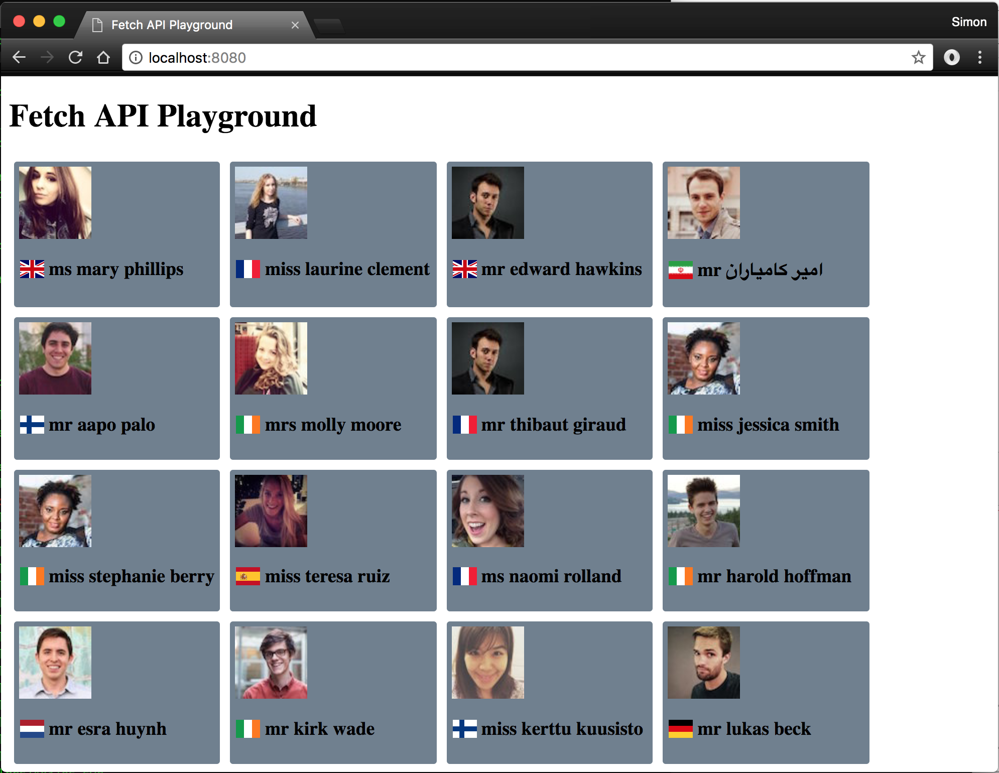

# Fetch API Demo for San Diego JS Exercise



## Overview

Demo that I put together with [Grant](https://github.com/grantglidewell) as part of the coding exercises for San Diego JS "Fundamental JS" meetup on April 25th 2018.

The aim was to use the [Fetch API](https://developer.mozilla.org/en-US/docs/Web/API/WindowOrWorkerGlobalScope/fetch) to get data from a remote source and display it on a page.

This demo uses the excellent [randomuser.me API](https://randomuser.me/documentation) to get random person data, and displays some of it using a [flexbox](https://developer.mozilla.org/en-US/docs/Web/CSS/CSS_Flexible_Box_Layout/Basic_Concepts_of_Flexbox) layout.

Additionally it uses CSS and icons from [flag-icon-css](http://flag-icon-css.lip.is/) to show the national flag of each user returned.

## Running Locally

Clone this repo, then cd to it and serve it using a static web server.

### With Python

```
python -m SimpleHTTPServer
```

Then visit `http://localhost:8000`.

### With Node.js

```
npm install -g node-static
```

cd to wherever you cloned the repo to, then:

```
static .
```

Then visit `http://localhost:8080`.
